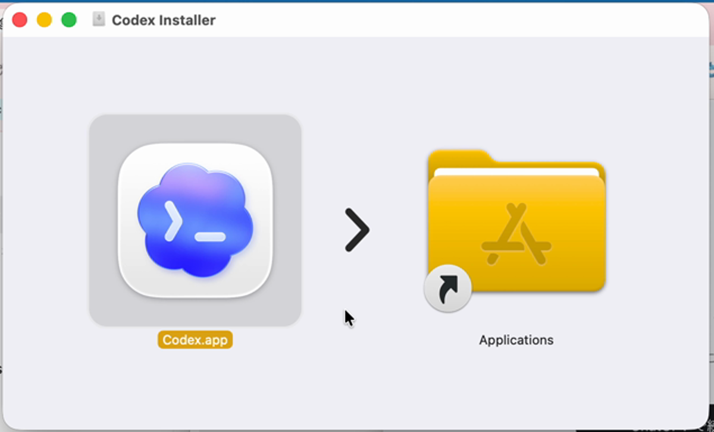
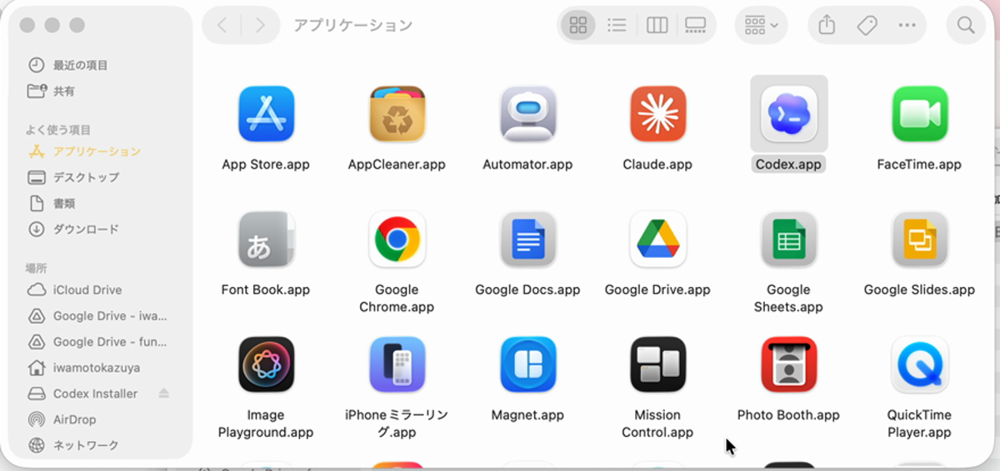
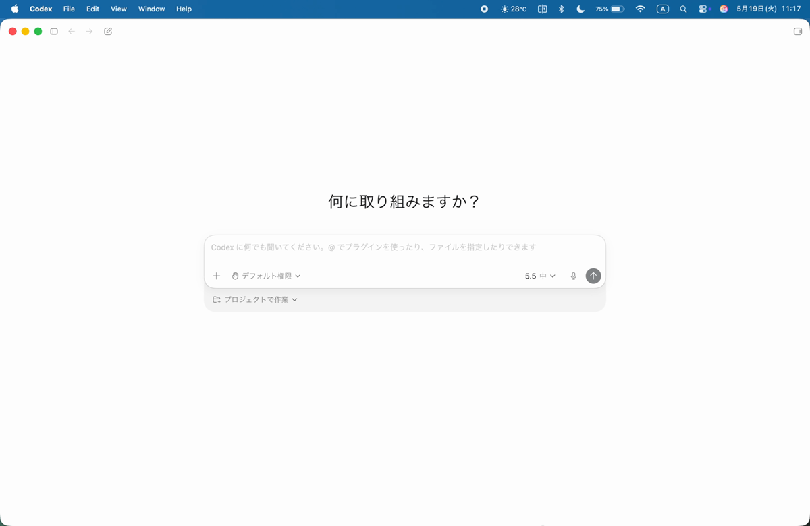
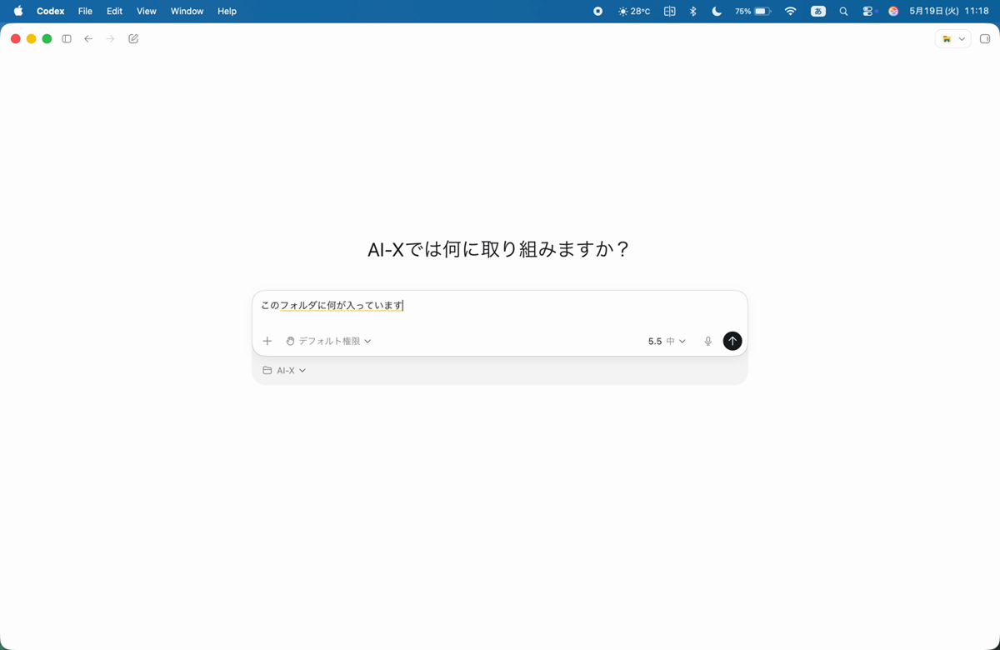
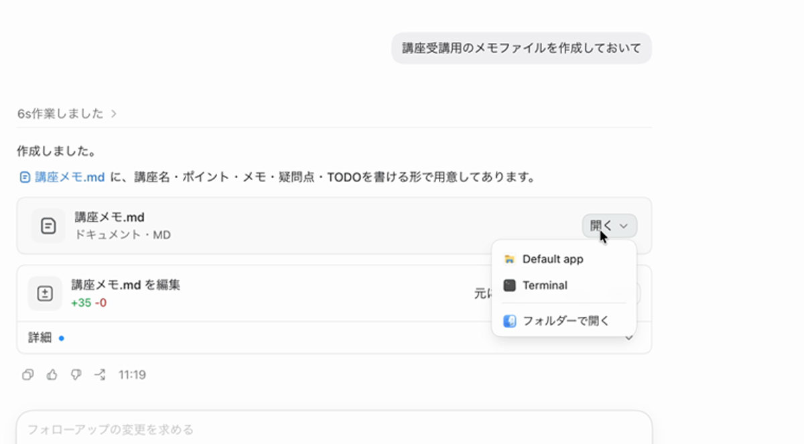

# Codexデスクトップ セットアップガイド Mac版

AI-X講座にお申し込みの皆様へ

講座当日は、Mac版のCodexデスクトップアプリを使って進めます。
事前にインストールと簡単な動作確認をお願いします。

## 事前に用意するもの

- ChatGPTにログインできるアカウント
- Mac
- 10〜15分ほどの作業時間

ChatGPTの有料版を使っている方は、そのアカウントでCodexを利用できます。
無料版でも現在はCodexを利用できる案内がありますが、利用上限や提供状況が変わる可能性があります。無料版で参加予定の方は、必ず講座前に動作確認まで済ませてください。

Claude CodeやClaude Coworkをすでに使っている方も、今回はCodexデスクトップアプリをダウンロードしてください。

## 1. Codexのダウンロードページを開く

下記ページを開きます。

https://openai.com/ja-JP/codex/get-started/

ページ内の案内から、Mac版のCodexをダウンロードします。


表示されたMac版のダウンロードボタンから進めてください。

## 2. CodexをApplicationsに入れる

ダウンロードしたファイルを開くと、下のような画面が出ます。

Codex.appをApplicationsフォルダへドラッグしてください。



ApplicationsフォルダにCodex.appが入っていればインストール完了です。



## 3. Codexを開いてサインインする

ApplicationsフォルダからCodexを開きます。

初回はChatGPTアカウントでサインインしてください。

アカウント選択や確認画面が表示された場合は、講座で使うChatGPTアカウントを選んで進めます。

## 4. 練習用フォルダを作る

デスクトップに練習用フォルダを作ります。

フォルダ名は `AI-X` にしてください。

## 5. Codexでプロジェクトを選ぶ

Codexを開くと、最初に「何に取り組みますか？」という画面が表示されます。

画面下の「プロジェクトで作業」から、先ほど作った練習用フォルダを選びます。



## 6. 最初の依頼を送る

まずは、次のように入力して送ってみます。

```text
このフォルダについて説明してください。まだ何もなければ、空のフォルダだと教えてください。
```



Codexがフォルダの中身を確認して返答すれば成功です。


## 7. ファイル作成を試す

次に、ファイル作成を頼んでみます。

```text
講座受講用のメモファイルを作成しておいて
```

Codexが変更内容を表示したら、内容を確認してから承認してください。

作成されたファイルが表示されれば、動作確認は完了です。



## 確認チェックリスト

- [ ] ChatGPTにログインできる
- [ ] Codexデスクトップアプリをインストールした
- [ ] CodexアプリにChatGPTアカウントでログインできた
- [ ] 練習用フォルダを作成した
- [ ] Codexでそのフォルダをプロジェクトとして選べた
- [ ] Codexに最初の依頼を送れた
- [ ] ファイル作成まで試せた

## エラーが出た場合

以下を控えて、講座前に共有してください。

- エラー画面のスクリーンショット
- 止まった手順
- 表示されたエラーメッセージ

## 注意

初回練習では、実際の顧客情報・個人情報・社外秘資料は使わないでください。

まずは練習用フォルダやダミー資料で動作確認をしてください。
