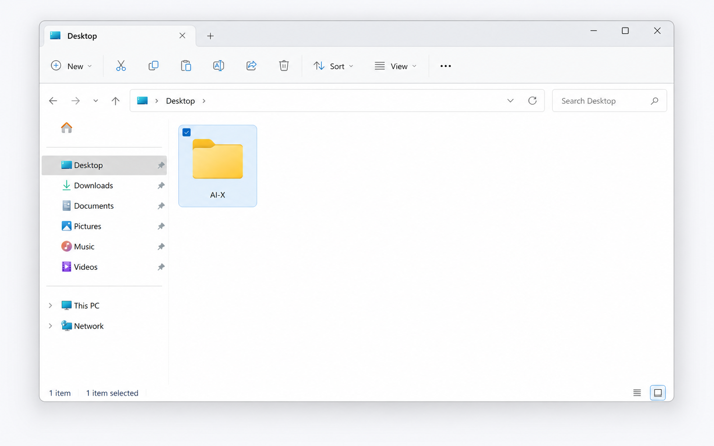
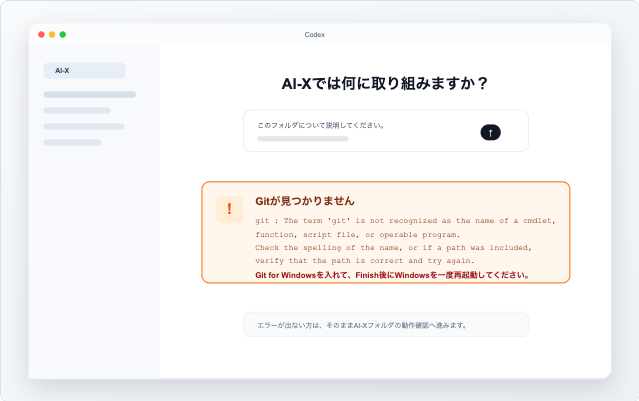

# Codexデスクトップ セットアップガイド Windows版

AI-X講座にお申し込みの皆様へ

講座当日は、Codexデスクトップアプリを使って進めます。
Windowsをご利用の方は、事前にインストールと簡単な動作確認をお願いします。

## 事前に用意するもの

- ChatGPTにログインできるアカウント
- Windows PC
- 10〜15分ほどの作業時間
- Gitエラーが出た場合は、Git for WindowsのインストールとWindows再起動が必要です

ChatGPTの有料版を使っている方は、そのアカウントでCodexを利用できます。
無料版でも現在はCodexを利用できる案内がありますが、利用上限や提供状況が変わる可能性があります。無料版で参加予定の方は、必ず講座前に動作確認まで済ませてください。

Claude CodeやClaude Coworkをすでに使い慣れている方は、講座中の作業でそのまま使っていただいても大丈夫です。
ただし、当日の説明画面はCodexを基準にするため、Codexデスクトップアプリのダウンロードと動作確認は事前にお願いします。

## 1. Codexのダウンロードページを開く

下記ページを開きます。

https://openai.com/ja-JP/codex/get-started/

ページ内の案内から、Windows版のCodexをダウンロードします。


「Windows版をダウンロードする」を押してください。

## 2. Codexをインストールする

ダウンロード後、画面の案内に従ってCodexをインストールします。

Windowsの確認画面が出た場合は、内容を確認して進めてください。

## 3. Codexを開き、ChatGPTアカウントでサインインする

インストール後、Codexを開きます。

初回はChatGPTアカウントでサインインしてください。

メールアドレス、Googleアカウント、Microsoftアカウントなど、ご自身がChatGPTで使っている方法を選びます。


## 4. サインイン完了を確認する

ブラウザに「Signed in to Codex」と表示されたら、タブを閉じてCodexアプリに戻ります。


## 5. AI-Xフォルダを作る

エクスプローラーでデスクトップを開き、右クリックして「新規作成」から「フォルダー」を選んでください。

フォルダ名は `AI-X` にしてください。



## 6. Gitエラーが出るか確認する

Codexで `AI-X` フォルダを開いたあと、Gitに関するエラーや案内が出る場合があります。

「git が認識されない」「Gitが見つからない」などの表示が出た方だけ、次の手順に進んでください。

何も出ていない方、すでにGitが入っている方は、次のGitインストール手順を飛ばして動作確認へ進んでください。



## 7. 必要な人だけGitを入れて再起動する

GitエラーやGitの案内が出た方は、Git for Windows公式ページからインストーラーをダウンロードします。

https://git-scm.com/install/windows

基本的には **Standalone Installer** の **Git for Windows/x64 Setup** を選びます。

基本設定のままNextで進め、最後にFinishを押してください。

**重要: Gitを新しく入れた方は、Finishまで完了したあとWindowsを一度再起動してください。**

再起動後、Codexをもう一度開き直して作業を続けます。

## 8. Codexでプロジェクトを選ぶ

Codexを開き、先ほど作った `AI-X` フォルダをプロジェクトとして選びます。


## 9. 最初の依頼を送る

まずは、次のように入力して送ってみます。

```text
このフォルダについて説明してください。まだ何もなければ、空のフォルダだと教えてください。
```

Codexがフォルダの中身を確認して返答すれば成功です。

## 10. ファイル作成を試す

次に、ファイル作成を頼んでみます。

```text
講座受講用のメモファイルを作成しておいて
```

Codexが変更内容を表示したら、内容を確認してから承認してください。

作成されたファイルが表示されれば、動作確認は完了です。

## 確認チェックリスト

- [ ] ChatGPTにログインできる
- [ ] Codexデスクトップアプリをインストールした
- [ ] CodexアプリにChatGPTアカウントでログインできた
- [ ] AI-Xフォルダを作成した
- [ ] WindowsでGitを入れた方は再起動した
- [ ] Codexでそのフォルダをプロジェクトとして選べた
- [ ] Codexに最初の依頼を送れた
- [ ] ファイル作成まで試せた

## Windowsでうまくいかない時

まずはCodexアプリの再起動、サインインし直し、別のネットワークでの確認を試してください。

### ダウンロードや起動で止まる

Microsoft StoreからCodexを開けない、または起動直後に止まる場合は、Microsoft Storeの「ダウンロード」画面で更新を確認し、Codexを再起動してください。

### サインイン画面が白い、または通信エラーが出る

VPN、プロキシ、セキュリティ系の通信フィルターが影響することがあります。
Codexを再起動し、必要に応じて別の回線でも試してください。

### 「Working」のまま進まない

30〜60秒待っても変わらない場合は、作業を止めて新しいスレッドで短い依頼からやり直してください。
最初はフォルダ説明だけで十分です。

### PowerShellの実行エラーが出る

「running scripts is disabled」のような表示は、Windowsの実行ポリシーでコマンドが止まっている状態です。
講座前準備では設定を変えず、画面を共有してください。

### WindowsでGitエラーが出る

「git が認識されない」「Gitが見つからない」などの表示が出た方だけ、Git for Windowsを入れます。
Finish後は必ずWindowsを再起動し、Codexを開き直してください。

### Gitを入れたのに認識しない

まずWindowsを再起動します。
それでも変わらない場合は、Codexを終了してから開き直し、表示されたエラー画面を保存してください。

### 管理者権限を求められる

会社や学校のPCでは、インストールや一部の操作に管理者権限が必要な場合があります。
自分で変更できない場合は、PCの管理者に確認してください。

### 利用上限の表示が出る

無料版や利用量が多い場合は、Codexの上限に当たることがあります。
時間を置いて再度試すか、講座前にログインと最初の動作確認だけ済ませてください。

## エラーが解消しない場合

以下を控えて、講座前に共有してください。
その他のエラーが出た場合も、エラー画面のスクリーンショットを撮って保存しておいてください。

- エラー画面のスクリーンショット
- 止まった手順
- WindowsでGitを入れたか、再起動したか
- 表示されたエラーメッセージ

## 注意

初回練習では、実際の顧客情報・個人情報・社外秘資料は使わないでください。

まずは練習用フォルダやダミー資料で動作確認をしてください。
